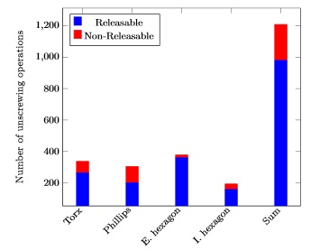

# dataset_unscrewing

## Introduction

This repo contains the data used in paper XXXXXXXXX published in XXXXXXXX on XX.XX.XXXX.

## Dataset Structure

The different datasets each contain two folders. These folders contain train and test data. The train and test data is split by lables into loesbar (releasable) and nicht_loesbar (non_releasable) in each folder. 
Each json file contains the data of one unscrewing process and contains different key values that provide information about the unscrewing process. 

## Key parameter
The tourque can be optained with following python code:
path = data path
with open(path) as f:
            df = json.loads(f.read())
torque = np.array(df['tightening steps'][0]['graph']['torque values'][0:self.sequence_length])
The corresponding angle values have euqidistand steps of 5.320°.

||
|test|

The file also contains other important keyvalues:
* df['prg name']: screw type
* df['tightening steps']['torque']: max tourque
* df['tightening steps']['speed']: max speed

|Dataset   |Description                 |Trial Number  |Train/Test       |
|:--------:|----------------------------|:------------:|-----------------|
|1         |Benchmark                   |1 & 2         |80%/20%          |
|2         |Screw Size Independency     |3             |80%/20% (M4,M5/M6,M8)|
|3         |Screw Head Independency     |4             |80%/20% (Torx, E. Hexagon/ Philips, I. Hexagon)|
|4         |Sparse Dataset1             |5             |20%/80%          |
|5         |Sparse Dataset2             |6             |160/80 datasets  |
|6         |Sparse Dataset3/Half Data   |7             |80%/20%          |

## Used Hardware
Nexo NXP

## Acknowledgement
Sponsored by the Ministry of the Environment Baden-Württemberg, in the context of the Strategic Dialogue Automotive Industry, and supervised by the Project Management Agency Karlsruhe (PTKA). Funding number: L7520101

https://www.ipa.fraunhofer.de/de/referenzprojekte/DeMoBat.html

